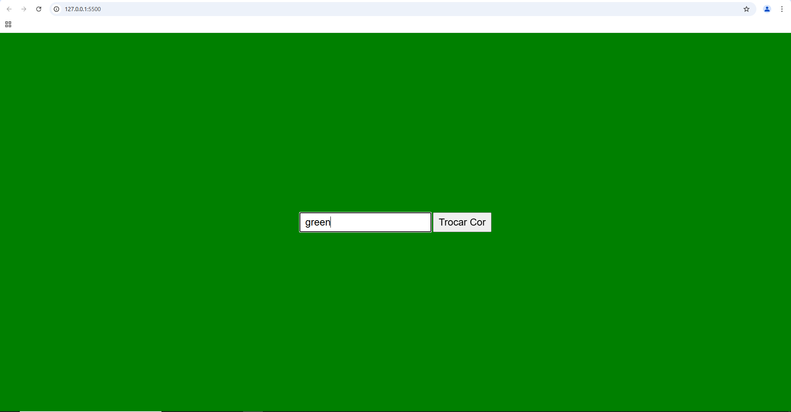

# Trocar a cor do site

## Sobre
Projeto para trocar a cor da pagina utilizando o JS.
O intuito deste site é colocar em prática o conhecimento adquirido sobre as linguagens de marcação, HTML, CSS, JS e Markdown,realizadas no curso técnico de desenvolvimento de sistemas do [SENAI Jandira](https://sp.senai.br/unidade/jandira/)

## Tecnologias utilizadas
- HTML
- CSS 
- Markdown
- Git
- JS

## Autor
- [Hiago Rodrigues](https://www.linkedin.com/in/hiago-rodrigues-ortolan-8a3507327/)